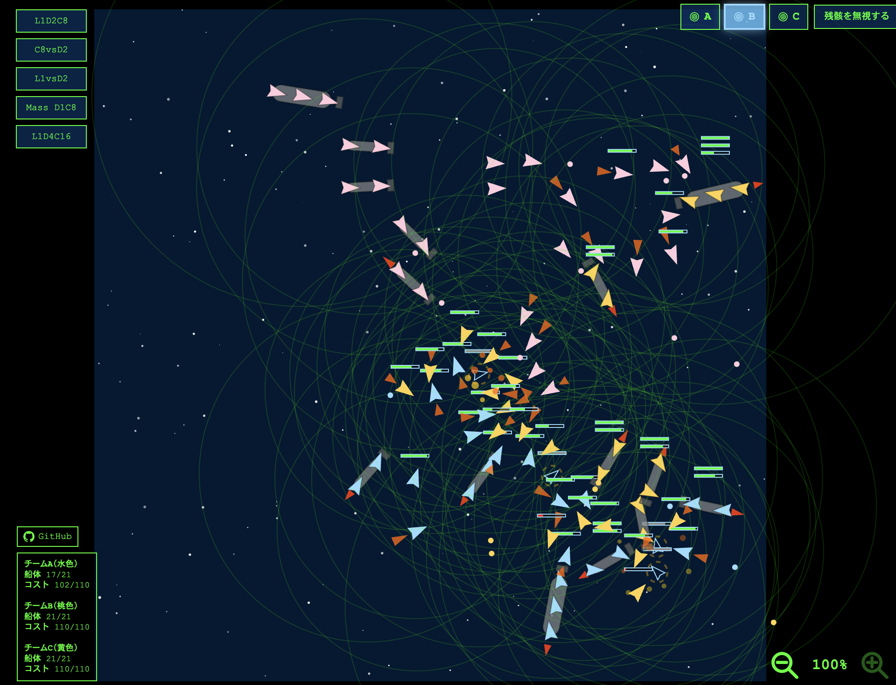

# Starship Sim 🧪

## 📋 このアプリについて

**Starship Sim** は、単一の HTML ファイルで完全に動作する **2次元宇宙戦闘シミュレーションゲーム**です。

- 外部ライブラリなし - Vanilla JavaScriptのみで実装
- 即座に実行可能 - ブラウザで index.html を開くだけで動作
- 物理ベース - 慣性・加速・回転などリアルな物理演算を実装
- モジュラー艦船設計 - 船体・エンジン・武器・レーダーを組み合わせて多様な艦を構成
- 決定論的AI - すべてのチームが統一ルールに従って自動で動く
- 複数テストシーン - 11種類の異なる艦隊構成でシミュレーション実行可能

---

## 🎬 ゲーム画面



*3チームの艦隊が同時に自動戦闘を繰り広げる様子。右上でテストシーンを選択、右下でビーコン操作チームを選択し、画面をクリックしてビーコンを配置することでシミュレーションを制御します。*

---

## 🎮 基本仕様

### 実行環境
- **ファイル形式**: 単一の HTML ファイル（`index.html`）
- **実行方法**: ブラウザで `index.html` を開くだけ
- **実行時依存**: なし（外部ライブラリ不要）
- **開発時依存**: Node.js（ビルド時のみ）

### コード規模
- **総行数**: 約 2,016 行（HTML + CSS + JavaScript 一体）
- **クラス数**: 11 個
- **技術**: Canvas API + requestAnimationFrame + vanilla JavaScript

---

## 🎯 アプリの目的

このプロジェクトは以下を実証・実験するための研究的シミュレーターです：

1. **物理エンジンの実装**
   - 慣性・加速・減速・回転
   - 摩擦（毎フレーム速度の 2% を減速）
   - 画面端での斥力

2. **AI 戦闘ロジック**
   - 敵認識・追跡・目標選択
   - 決定論的な自動制御（乱数なし）

3. **モジュラー艦船設計**
   - 船体 + エンジン + 武器 + レーダーの組み合わせ
   - コスト（重量）ベースのバランスシステム

---

## 🛠 開発ビルド

配布物は従来どおり `index.html` 単体です。  
開発時は分割ソースを編集し、ビルドで `index.html` を再生成します。

- テンプレート: `index-src.html`
- CSSソース: `src/css/app.css`
- TypeScriptソース:
  - `src/ts/main.ts`
  - `src/ts/components.ts`
  - `src/ts/projectiles-effects.ts`
  - `src/ts/starship.ts`
  - `src/ts/scenes.ts`
  - `src/ts/game-loop.ts`
- 開発実行用JS（ビルド生成）:
  - `src/js/main.js`
  - `src/js/components.js`
  - `src/js/projectiles-effects.js`
  - `src/js/starship.js`
  - `src/js/scenes.js`
  - `src/js/game-loop.js`
- ビルドスクリプト: `scripts/build.mjs`

開発中の素早い確認:

```bash
# ブラウザで index-src.html を直接開いて動作確認
```

配布用単一ファイルの再生成:

```bash
npm run build
```

ユーティリティテストの実行（Vitest）:

```bash
npm test
```

TypeScript 型チェック:

```bash
npm run typecheck
```

### 運用ルール（タイトル固定）

- HTML の `<title>` は `starship-sim : Starship Simulation` を固定値とする
- `index-src.html` / `index.html` のタイトルは、明示的な合意がない限り変更しない

---

## 🚢 ゲームの仕組み

### 3チーム自動戦闘

画面上で 3 チームの艦隊が同時に戦闘します：

| チーム | 色 | 制御方式 |
|--------|-----|--------|
| チーム A | 水色 | マウス操作 or 自動AI |
| チーム B | 桃色 | 完全自動AI |
| チーム C | 黄色 | 完全自動AI |

### 艦船の構成例

```
艦船 = 船体 × 1
     + 推進エンジン × 1
     + 射撃ユニット × 1～2
     + レーダー × 1
```

各コンポーネントは独立した HP を持ち、破壊されると段階的に機能喪失します。

### 戦闘フロー

1. **索敇** - レーダー範囲内（150～225px）で敵を認識
2. **追跡** - 敵に向かって加速・回転
3. **射撃** - 距離と角度が条件を満たしたら自動発火
4. **ダメージ** - 被弾時に HP 低下、要素破壊時は機能喪失
5. **破壊** - 最後のユニット破壊時に爆発

---

## 🎮 操作方法

### 基本操作

1. **テストシーン選択** - 画面右上のボタンで艦隊構成を選択
2. **ビーコン操作モード選択** - 画面右下で対象チームを選択
3. **ビーコン配置** - 画面をクリック/タッチして検出ビーコンを配置
4. **シミュレーション開始** - ビーコン配置時点で自動開始

### ビーコンの役割

検出ビーコン内に入ったユニットは自動的に活性化され、周囲を索敇・攻撃開始します。

---

## 📊 主要クラス一覧

### 艦船コンポーネント

| クラス | 用途 | 主なパラメータ |
|--------|------|---------|
| `Hull` | 標準船体 | HP: 100, 重さ: 1 |
| `LargeHull` | 大型船体 | HP: 300, 重さ: 3 |
| `Hull5` | 軽巡船体 | HP: 500, 重さ: 5 |
| `ThrusterEngine` | 推進エンジン | 推進力: 0.5, 旋回: 0.1 rad/frame |
| `AdvancedRadar` | 索敇ユニット A | 範囲: +30px |
| `RadarB` | 索敇ユニット B | 範囲: +45px |
| `WeaponUnit` | 標準射撃ユニット | HP: 100, 射撃間隔: 60f |
| `IndependentTurretB` | 高火力砲塔 | HP: 200, 射撃間隔: 90f |

### その他の要素

| クラス | 用途 |
|--------|------|
| `Starship` | 複数コンポーネントを統合した艦船 |
| `Bullet` | 弾丸（最大 300 フレーム存在） |
| `Particle` | パーティクル（爆発エフェクト） |
| `DetectionBeacon` | 検出ビーコン |

---

## 🧪 テストシーン（11種類）

プリセット構成で異なる艦隊構成をテストできます：

- **D1C8vsD1C8** - 混合艦隊（大型 1 + 小型 8）同士
- **C9vsC9** - 小型艦大規模戦（各 9 隻）
- **D4vsD4** - 大型艦戦（各 4 隻）
- **L1vsL1** - 軽巡同士（各 1 隻）
- **3WAY D1C8** - 3チーム同時戦闘
- ほか 6 種類

各シーン選択時に艦隊が自動生成され、すぐにシミュレーションが開始されます。

---

## ⚙️ 物理パラメータ

### 速度・加速

| パラメータ | 値 |
|-----------|-----|
| 最高速度 | 2.0 u/frame |
| 標準加速 | 0.5 u/frame² |
| 減速（摩擦） | 毎フレーム速度の 2% |
| 旋回速度 | 0.1 rad/frame（標準） |

### 画面端の挙動

| パラメータ | 値 |
|-----------|-----|
| 斥力範囲 | 画面端から 80px |
| 最大斥力 | 0.05 u/frame² |

### 戦闘パラメータ

| パラメータ | 値 |
|-----------|-----|
| 索敇範囲（基本） | 150～225px |
| 射撃間隔（標準） | 60 フレーム |
| 射撃間隔（高火力） | 90 フレーム |
| ダメージ（1発） | 10～20 |

---

## 🎨 ビジュアル機能

### 情報表示

画面上に以下の情報がリアルタイム表示されます：

- **艦船の状態**: 位置・速度・回転角度
- **HP 情報**: 全体 HP・各コンポーネント HP
- **戦闘情報**: 敵艦数・残弾数
- **HP バー**: HP 状態を色で表示
  - 緑: HP > 30%
  - 赤: HP ≤ 30%

### エフェクト

- **パーティクル爆発** - 艦船破壊時に発生
- **破損表示** - 破損ユニットをオレンジ色の破線円で表示
- **トレイル** - 弾丸の軌跡表示

---

## 🏗️ 設計思想

このプロジェクトが外部ライブラリに依存しない理由：

1. **即座の共有性** - ファイル 1 つで配布可能
2. **教育的価値** - コード全体が 1 ファイルで即座に理解可能
3. **オフライン実行** - ネットワーク接続不要
4. **実験性** - 配布は単一HTMLのまま、開発時のみビルド導入で迅速に改善可能
5. **透明性** - すべてのロジックがオープン（ブラックボックスなし）

---

## 📂 プロジェクト構成

```
starship-sim/
├── index-src.html          # 開発用テンプレート
├── index.html              # 配布用単一ファイル（ビルド生成物）
├── src/
│   ├── css/app.css         # 開発用CSS
│   ├── ts/
│   │   ├── main.ts         # TypeScriptソース
│   │   ├── components.ts
│   │   ├── projectiles-effects.ts
│   │   ├── starship.ts
│   │   ├── scenes.ts
│   │   └── game-loop.ts
│   └── js/
│       ├── main.js         # ビルド生成JS（開発実行用）
│       ├── components.js
│       ├── projectiles-effects.js
│       ├── starship.js
│       ├── scenes.js
│       └── game-loop.js
├── scripts/build.mjs       # 単一HTML生成スクリプト
├── package.json            # npm scripts（build）
├── tsconfig.json           # TypeScript設定
├── README.md               # プロジェクト説明
├── BUILD_PROCESS.md        # ビルド方式の設計
├── ARCHITECTURE.md         # 設計方針と技術決定
├── SHIP_TYPES.md           # 艦船の仕様定義
├── UNIT_TYPES.md           # コンポーネント仕様一覧
├── SCREEN.md               # 画面構成ガイド
├── DETECTION_LOGIC.md      # 索敇・目標選択ロジック
├── TODO.md                 # 拡張予定
└── LICENSE                 # MIT License
```

---

## 🎓 学習価値

このプロジェクトから学べること：

- **物理エンジンの実装** - 2D 物理シミュレーションの基礎
- **ゲームループ設計** - requestAnimationFrame を使った効率的な描画ループ
- **AI 制御** - 決定論的な NPC 動作・目標選択アルゴリズム
- **モジュラー設計** - コンポーネントの組み合わせによる柔軟な拡張性
- **Canvas API** - ブラウザネイティブなグラフィックス描画
- **イベント駆動設計** - マウス/タッチ入力の処理

---

## 💡 まとめ

**Starship Sim** は、シンプルながら奥深い物理演算とゲーム AI を備えた、教育的かつ実験的なシミュレーションです。

単一 HTML ファイルという制約の中で、複雑なゲームロジックを実装する優れた事例として、また新しい艦設計や AI アルゴリズムを迅速にテストするプラットフォームとして機能しています。

# Appendix

## 船種一覧

| 呼称 | 正式名 | 説明 |
|---|---|---|
| **船種C** | 搭載艦（Corvette） | 小型艦。1つの射撃ユニットを搭載 |
| **船種D** | 駆逐艦（Destroyer） | 大型艦。2つの射撃ユニットを搭載 |
| **船種L** | 軽巡洋艦（Light Cruiser） | 大型艦。3つの射撃ユニットを搭載 |

## 仕様

### コストシステム

各コンポーネントのコストは重量に一致します：

- **標準船体**: コスト1（重量1）
- **大型船体**: コスト3（重量3）
- **船体5**: コスト5（重量5）
- **標準推進エンジン**: コスト1（重量1）
- **標準射撃ユニット**: コスト1（重量1）
- **独立砲塔射撃ユニット**: コスト2（重量2）
- **レーダーA (Radar A)**: コスト1（重量1）
- **レーダーB (Radar B)**: コスト2（重量2）

**艦隊構成別コスト**
- **船種C（Corvette）**: 1 + 1 + 1 = **コスト3**
- **船種D（Destroyer）**: 3 + 2 + 4 + 1 = **コスト10**
- **船種L（Light Cruiser）**: 5 + 3 + 12 + 4 = **コスト24**

### 物理パラメータ

- **艦のサイズ**: 12 ピクセル
- **最高速度**: 2 u/frame
- **回転速度**: 0.1 rad/frame（標準推進エンジン）
- **スラスタ出力**: 0.05 u/frame²
- **推力調整**: 目標方向との角度差に応じて 0～100% に調整
- **摩擦**: 毎フレーム速度の 2% を減速

### 画面端の物理

- **斥力範囲**: 画面端から 80 ピクセル
- **最大斥力**: 0.05 u/frame²
- **敵艦の目標修正**: 画面端近くで中央方向に 60% 修正

## ライセンス

MIT License
